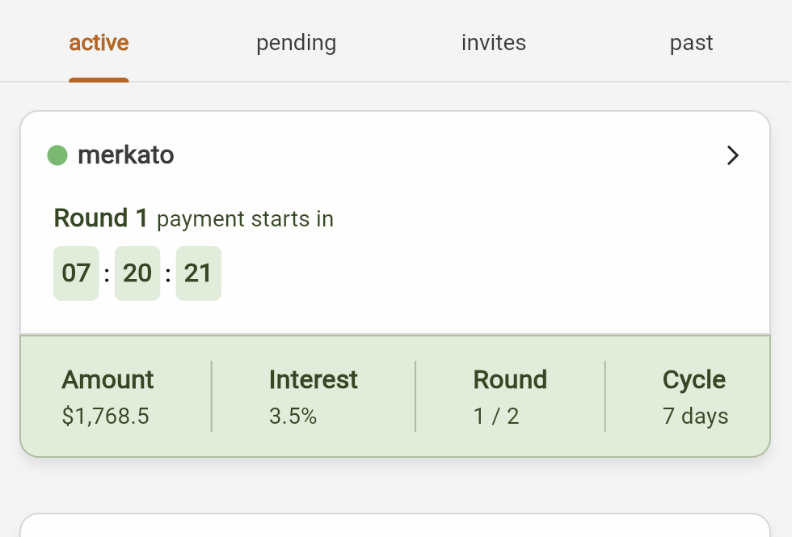
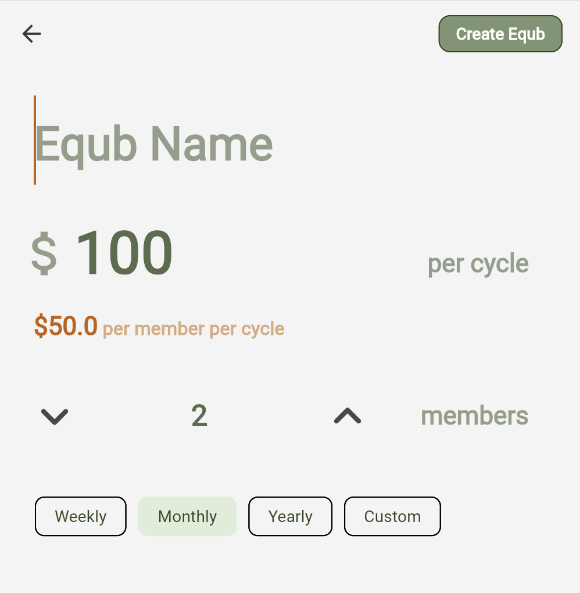
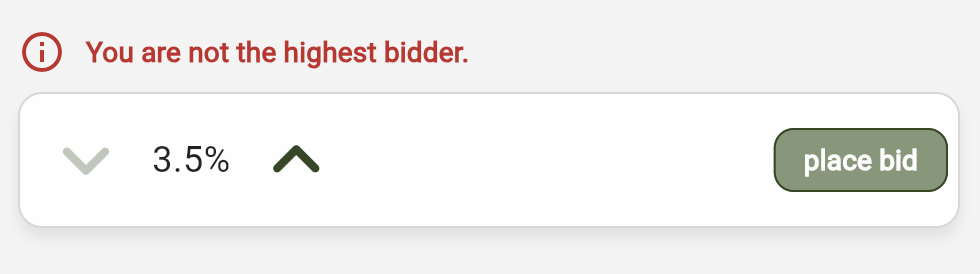
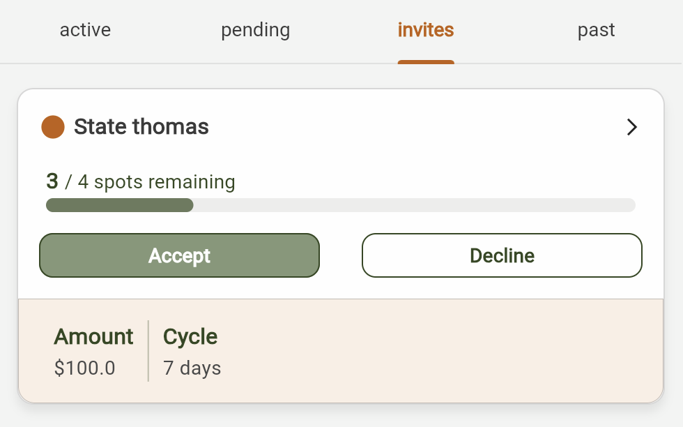
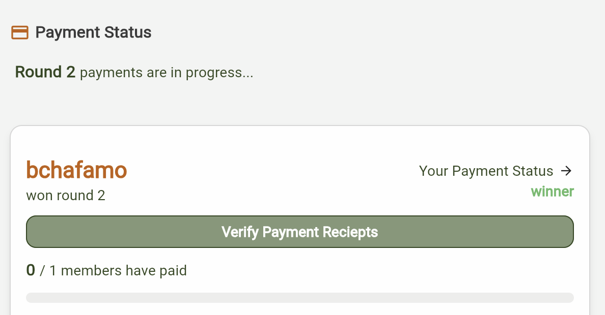
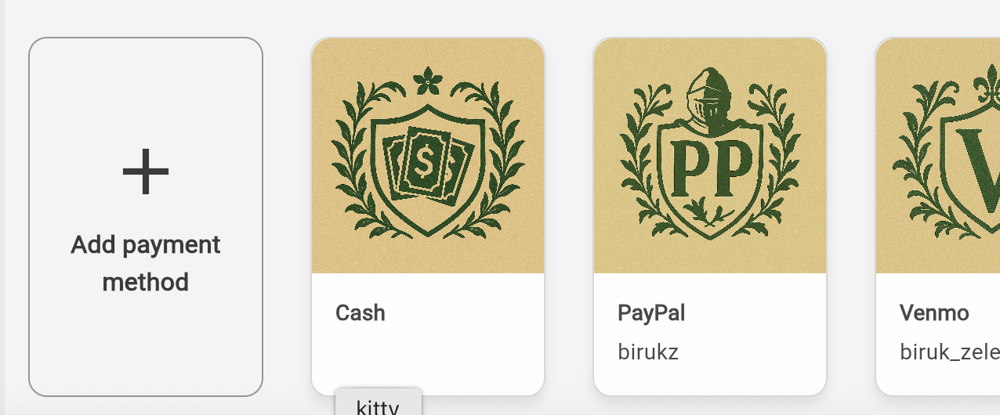
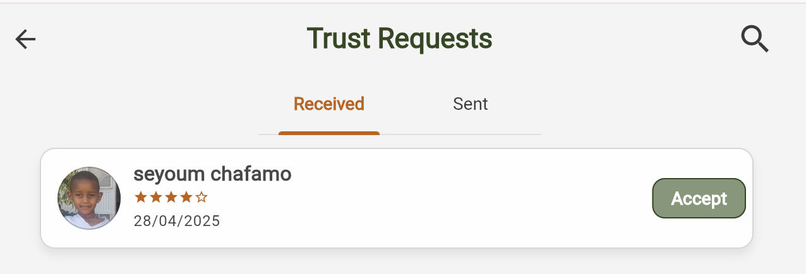

# [equbfinance.com](https://app.equbfinance.com)

A digital platform for traditional rotating savings groups. Check it out at [app.equbfinance.com](https://app.equbfinance.com)

<p align="center">
  
</p>

## What is Equb?

An equb is a rotating savings group where members pool money together. Each cycle (weekly, monthly, etc.), members contribute a fixed amount, and one person takes home the entire pool. This continues until everyone has had their turn.

Equb Finance brings this tradition online, making it easy to organize groups, track contributions, and introduces a bidding process.

## Features

### Dashboard

Your home screen shows all your equb groups organized by status: active, pending (waiting for members), invites, and past. Each group card displays relevant info, like the pool amount, current round, cycle length, and a countdown to when the next payment phase begins.

<p align="center">
  
</p>

### Create Equb

Start a new group by setting the total pool amount, number of members, and cycle length (weekly, monthly, yearly, or custom).

<p align="center">
  
</p>

### Bidding

When a round opens, members can bid a percentage of the pool they're willing to give up. For example, bidding 3.5% means you'll only receive 96.5% of the pool if you win. The highest bidder wins that round. This creates a fair system where those who need the money most urgently can bid higher to get it sooner, while those who are willing to wait will receive a reward.

<p align="center">
  
</p>

### Invitations

When someone invites you to join their equb, you'll see the invitation here. The card shows how many spots are left, the contribution amount, and the cycle length.

<p align="center">
  
</p>

### Payment Status

After bidding closes and a winner is determined, the payment phase begins. Users can see who won and track how many members have paid. The winner of a round can verify incoming payments. Members see where to send their contribution based on the winner's saved payment methods. Once the winner receives the total sum and verifies receipt, the next round will begin.

<p align="center">
  
</p>

### Payment Methods

Users can ada payment accounts (PayPal, Venmo, bank details, etc.) so that when they win a round, other members know where to send their contributions.

<p align="center">
  
</p>

### Trust Network

Before joining an equb with someone, you might want to know they're reliable. The trust system lets users send and accept trust requests. You can see a member's trust rating, which will be algorithmiclly determined using several inputs, such as their trust network and history of on-time payments.

<p align="center">
  
</p>

## How It Works

1. **Create or join a group**
2. **Invite members:** The equb starts once all spots are filled
3. **Bidding opens:** Each round, members bid a percentage they're willing to forfeit
4. **Winner receives the pool:** The highest bidder wins and collects from all members
5. **Payment verification:** The winner confirms receipt of payments
6. **Repeat:** The cycle continues until everyone has won once

## Tech Stack

**Frontend**

- Flutter/Dart
- BLoC state management
- WebSocket for real-time updates

**Backend** ([Equb-V3](https://github.com/biruk-chafamo/Equb-V3))

- Django / Django REST Framework
- Channels (WebSocket)
- PostgreSQL
- Redis

## Getting Started (Contributors)

### Prerequisites

- Flutter SDK
- Python 3.12+
- Docker (recommended) or PostgreSQL + Redis installed locally

### Clone Both Repos

```bash
git clone https://github.com/biruk-chafamo/Equb-V3.git
git clone https://github.com/biruk-chafamo/equb_v3_frontend.git
```

### Backend Setup

```bash
cd Equb-V3/Equb

# Option A: Docker (recommended)
docker-compose up --build

# Option B: Local setup
python -m venv venv
source venv/bin/activate  # Windows: venv\Scripts\activate
pip install -r ../requirements.txt

# Create .env file with required variables (see .env.example)
python manage.py migrate
python manage.py runserver
```

The API will be available at `http://localhost:8000`.

### Frontend Setup

```bash
cd equb_v3_frontend
flutter pub get
flutter run
```

The frontend expects the backend at `localhost:8000` by default. Update the API base URL in `lib/` if your backend runs elsewhere.

### Running Both

1. Start the backend first (Docker or local)
2. Run the Flutter app with `flutter run`
3. For WebSocket features, ensure Redis is running (Docker handles this automatically)
